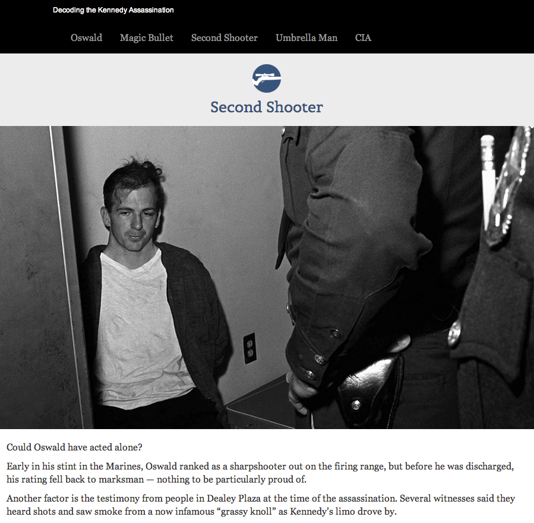

jfk
===

What is this?
-------------
Decoding the Kennedy Assassination, a project examining the conspiracy theories behind John F. Kennedy's death, 50 years later.

Live demo: http://data.digitalfirstmedia.com/jfk/

Credits
---------

Jason Fields, Daniel Fuentes, Sarah Glen, Nelson Hsu, Simran Kholsa, Yvonne Leow, Tom Meagher, Courtney Wells 

Assumptions
-----------
* jQuery
* Bootstrap
* skrollr js
* lazyload js

License
----------

This code is available under the MIT license. For more information, please see the LICENSE file in this repo.

